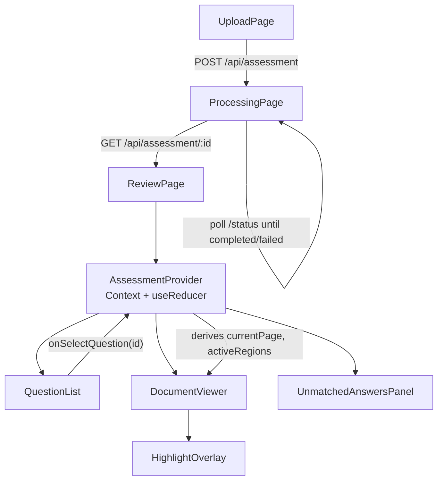

# ARCHITECTURE.md — AI Assessment Extraction & Answer Mapping (VedaAI)

Companion to `PRD.md`. This document specifies *how* the system is built; `PRD.md` specifies *what* it must do. Read PRD.md first — this document assumes its domain model, API contracts, and scope boundaries as given.

---

## 1. System Architecture (overview)

A single Next.js application (App Router), deployed as one long-lived Node server, serving both the existing frontend (baseline UI, unmodified in structure) and a small set of API routes. No separate backend service, no queue, no database — deliberately, per the timebox and the brief's own constraints ("no database," "no auth," "in-memory storage is sufficient").

```mermaid
flowchart LR
    subgraph Browser
        UI[Existing Stitch UI\nUpload / Processing / Review]
    end

    subgraph "Next.js Server (single Node process)"
        API[API Routes\n/api/assessment/*]
        Store[(In-memory Store\nMap&lt;id, Assessment&gt;)]
        Pipeline[Processing Pipeline\n(async, non-blocking)]
        Raster[PDF/Image Rasterizer]
        Provider[DocumentAIProvider\ninterface]
    end

    subgraph External
        Gemini[Google Gemini API\n(vision + JSON mode)]
    end

    UI -- "POST /api/assessment (multipart)" --> API
    UI -- "GET /status (poll)" --> API
    UI -- "GET /api/assessment/:id" --> API
    UI -- "GET /page/:docType/:n (img)" --> API

    API --> Store
    API --> Pipeline
    Pipeline --> Raster
    Pipeline --> Provider
    Provider --> Gemini
    Pipeline --> Store
```

**Why one process, not serverless-per-function:** the pipeline is a multi-minute, multi-stage job that must keep running and keep updating shared in-memory status *after* the triggering HTTP request has already returned 202. That requires a process that outlives a single request — a standard serverless function invocation model (which typically freezes/kills compute once the response is sent) fights this. A single long-lived Node server (deployable on Render, Railway, Fly.io, a small VM, or Vercel's Node runtime with `waitUntil`/background functions if available) is the simplest architecture that matches the requirement. **Open Decision, default recommendation:** deploy on Render or Railway (free/low-cost tier, trivially deploys a Next.js `next start` process, supports long-lived background work) rather than a pure edge/serverless platform.

---

## 2. Monorepo Layout

```text
/ (repo root)
├── apps/
│   └── web/                      # the Next.js app — UI + API routes, one deployable unit
│       ├── app/
│       │   ├── exams/
│       │   │   ├── page.tsx              # Upload screen
│       │   │   └── [assessmentId]/
│       │   │       ├── processing/page.tsx
│       │   │       └── review/page.tsx
│       │   └── api/
│       │       └── assessment/
│       │           ├── route.ts                          # POST create+kick off
│       │           └── [id]/
│       │               ├── route.ts                      # GET full result
│       │               ├── status/route.ts                # GET status
│       │               └── page/[docType]/[n]/route.ts    # GET page image
│       ├── components/
│       │   ├── upload/           # dropzone, file card — existing markup, wired
│       │   ├── processing/       # stepper — existing markup, wired
│       │   └── review/           # question list, viewer, highlight overlay
│       ├── lib/
│       │   ├── domain/           # types from PRD §23, pure functions only
│       │   ├── pipeline/         # orchestration, one file per stage
│       │   ├── extraction/       # question + answer extraction logic (both paths)
│       │   ├── mapping/          # 3-tier mapping engine
│       │   ├── ai/               # DocumentAIProvider interface + GeminiDocumentAIProvider
│       │   ├── validation/       # Zod schemas
│       │   ├── raster/           # PDF/image → normalized PNG pages
│       │   └── store/            # in-memory Map singleton + accessors
│       └── public/
├── packages/
│   └── shared-types/             # (optional) domain types shared if a second app is ever added
├── PRD.md
├── ARCHITECTURE.md
└── README.md
```

**Assumption:** "monorepo" per the submission requirement is satisfied by an `apps/web` + `packages/shared-types` layout even though there is only one deployable app today — this is the simplest structure that is *genuinely* a monorepo (not a single flat repo mislabeled), while adding near-zero overhead (no Turborepo/Nx build orchestration is required for a single app; a plain npm/pnpm workspaces file is enough). **Open Decision:** if the coding agent judges even this is overhead for a 12–16h build, the simplest acceptable fallback is a flat Next.js repo with `PRD.md`/`ARCHITECTURE.md` at the root — acceptable but weaker against the literal "monorepo" instruction; the `apps/web` layout above is the recommended default.

---

## 3. Frontend Architecture

The existing UI is preserved as the component/visual layer. Architecture work here is entirely about **data plumbing**, not visuals.



**Component responsibility split:**

| Component | Owns | Does NOT own |
|---|---|---|
| `UploadPage` | local file state, validation errors, submit lifecycle | assessment data shape |
| `ProcessingPage` | polling interval, current stage | pipeline internals |
| `AssessmentProvider` | fetched `Assessment`, `selectedQuestionId`, `currentPage`, `currentDocType`, `viewerZoom` | network fetching mechanics beyond the initial load (kept in the page component, dispatched into context on success) |
| `QuestionList` | rendering question cards + status pills from context, expand/collapse UI state (local, per-card) | mapping logic (pure lookup only) |
| `DocumentViewer` | page rendering, zoom, nav controls | knowing *why* a page is selected — just renders whatever `currentPage`/`activeRegions` context gives it |
| `HighlightOverlay` | translating normalized `AnswerRegion` → CSS percentage box | selection logic |
| `UnmatchedAnswersPanel` | listing `Answer`s with no mapping, selecting one sets `currentDocType/currentPage` same as a question would | question data |

**State management decision:** React Context + `useReducer`, scoped to the Review route only. **Rejected:** Redux/Zustand/Jotai — the state graph is small (one assessment, one selection, one page, one zoom level) and lives for the duration of a single route; a global store adds a dependency and boilerplate with no corresponding benefit at this scale.

---

## 4. Backend Architecture

```mermaid
sequenceDiagram
    participant UI as Browser
    participant API as POST /api/assessment
    participant Store as In-memory Store
    participant Pipe as Pipeline (async, detached)
    participant Rast as Rasterizer
    participant AI as GeminiDocumentAIProvider
    participant Map as Mapping Engine

    UI->>API: multipart(questionPaper, answerSheet)
    API->>API: validate type/size
    API->>Store: create Assessment(status=queued)
    API-->>UI: 202 {assessmentId}
    API->>Pipe: void run(assessmentId)  // not awaited

    Pipe->>Store: status = uploading
    Pipe->>Rast: rasterize both documents
    Rast-->>Pipe: DocumentPage[] (per doc)
    Pipe->>Store: status = reading_question_paper

    Pipe->>Pipe: has text layer?
    alt text layer present
        Pipe->>Pipe: deterministic question extraction
    else no text layer
        Pipe->>Store: status = extracting_questions
        Pipe->>AI: extractQuestionsFromImages(pages)
        AI-->>Pipe: RawQuestionExtraction[]
        Pipe->>Pipe: Zod validate (retry once on failure)
    end

    Pipe->>Store: status = reading_answer_sheet
    loop each answer-sheet page
        Pipe->>AI: extractAnswerBlocks(page)
        AI-->>Pipe: RawAnswerBlock[]
        Pipe->>Pipe: Zod validate (retry once on failure;\nscope failure to this page only)
    end
    Pipe->>Store: status = detecting_answers (segmentation/assembly)

    Pipe->>Store: status = mapping_answers
    Pipe->>Map: run Tier1 -> Tier2 -> Tier3(AI) -> classify
    Map->>AI: suggestSemanticMappings(remaining)
    AI-->>Map: RawMappingSuggestion[]
    Map-->>Pipe: AnswerMapping[]

    Pipe->>Store: status = finalizing
    Pipe->>Store: persist questions/answers/mappings, status = completed

    UI->>API: GET /status (polling every ~1s)
    API->>Store: read status
    API-->>UI: {status, errorCode?}

    UI->>API: GET /api/assessment/:id (once completed)
    API->>Store: read full Assessment
    API-->>UI: Assessment JSON
```

**Concurrency model:** a single `assessmentId` is processed by a single pipeline run; the in-memory store is a plain `Map`, guarded only by the fact that Node is single-threaded per event loop tick — no locking needed at this scale (one demo user, one assessment at a time, per the brief's scope). If two assessments are created concurrently, they simply run as two independent async chains against two different Map keys — no shared mutable state between them.

**Failure isolation:** every pipeline stage is wrapped in its own try/catch. A caught error at the *page-level* (answer extraction) narrows the failure to that page (Edge Case 9/PRD §18); a caught error at the *document-level* (rasterization) sets `status: "failed"` with a scoped `errorCode` for the whole assessment, since there is nothing usable to fall back to.

---

## 5. AI Pipeline (detail)

```mermaid
flowchart TD
    QP[Question Paper Pages] --> HasText{Embedded\ntext layer?}
    HasText -- yes --> Det[Deterministic parser:\nregex numbering + line boxes]
    HasText -- no --> VisQ[Gemini: extractQuestionsFromImages]
    Det --> QOut[Question list, order preserved]
    VisQ --> ValQ[Zod validate] --> QOut

    AS[Answer Sheet Pages] --> PerPage[Per-page Gemini call:\nextractAnswerBlocks]
    PerPage --> ValA[Zod validate per page] --> Assemble[Assemble Answer records\n(merge multi-page by reference)]

    QOut --> T1[Tier 1: explicit reference match]
    Assemble --> T1
    T1 --> T2[Tier 2: structural/sequential]
    T2 --> T3[Tier 3: Gemini semantic suggestion\n(batched, remaining only)]
    T3 --> Classify[Classify: matched / needs_review /\nunanswered / unmatched]
    Classify --> Result[AnswerMapping[]]
```

**Why per-page for answer extraction but whole-document (with text layer) or per-document (vision fallback) for questions:** question papers are typically short and the model benefits from seeing the whole structure at once (or, better, needs no model call at all when text-layer parsing suffices). Answer sheets are handwritten and benefit from a tighter per-page prompt/response loop — smaller context reduces cross-page hallucination (e.g., inventing a reference from a different page) and keeps bounding boxes unambiguously page-relative.

**Prompt contract (conceptual, not literal prompt text):** every AI call's *system instruction* fixes the output shape and forbids prose (`"Respond with ONLY a JSON array matching this schema, no commentary."`), and every call sets the provider's structured-output/JSON mode when available, as a first line of defense before Zod even runs.

---

## 6. Data Flow (end-to-end)

```mermaid
flowchart LR
    Upload[Raw files] --> Raster[Normalized PNG pages\n+ width/height metadata]
    Raster --> QExtract[Questions\nid, number, text, order, parent/subPart]
    Raster --> AExtract[Answer blocks\ntext, bbox(0-1000 or 0-1 per provider), reference, confidence]
    AExtract --> Normalize[Coordinate normalization\ndivide by page width/height → 0-1 fractions]
    Normalize --> Segment[Segmentation & multi-page merge\n→ Answer[] with regions[]]
    QExtract --> Mapping
    Segment --> Mapping[3-tier mapping engine]
    Mapping --> Assessment[(Assessment record\nin-memory store)]
    Assessment --> API2[GET /api/assessment/:id]
    API2 --> Frontend[Review UI:\nQuestionList + Viewer + Highlight]
```

The single most important transformation in this diagram is **Normalize**: it is the one place where provider-specific coordinate scales (Gemini's documented 0–1000 normalized image scale, or raw pixel output from a text-layer parser) are converted into the domain model's fixed 0–1 fraction contract, so that nothing downstream — mapping, storage, API, or the frontend — ever needs to know which extraction path produced a given region.

---

## 7. Domain Model

See `PRD.md` §23 for the authoritative TypeScript definitions (`Assessment`, `Document`, `DocumentPage`, `Question`, `Answer`, `AnswerRegion`, `AnswerMapping`, `ProcessingStage`). This document does not duplicate them to avoid drift — treat PRD.md §23 as the single source of truth for types, and this file as the source of truth for how those types are produced/consumed.

One architectural note not covered in the PRD: **raw AI response types are never the same TypeScript types as the domain model.** Each AI call has its own `Raw*` type (`RawQuestionExtraction`, `RawAnswerBlock`, `RawMappingSuggestion`) validated by its own Zod schema (PRD §22); a dedicated mapper function in `lib/extraction/` or `lib/mapping/` converts `Raw* → domain type`, performing coordinate normalization, id assignment (`crypto.randomUUID()`), and defaulting. This boundary is what makes `DocumentAIProvider` swappable (§9 below) without touching the domain model or any UI code.

---

## 8. API Flow

Covered in full contract detail in `PRD.md` §24. Architecturally, note:

- All four routes are **stateless with respect to each other** — each reads/writes the in-memory store keyed by `assessmentId` from the URL; there is no session/cookie dependency, consistent with "no auth."
- The page-image route (`GET /api/assessment/:id/page/:docType/:n`) exists specifically so the main `GET /api/assessment/:id` JSON payload stays small (no embedded base64) and so the browser can leverage standard HTTP image caching (`Cache-Control` headers) across zoom/re-renders.
- `POST /api/assessment` intentionally returns before processing finishes (202, not 200) — this is what makes the Processing screen's polling loop meaningful rather than decorative.

---

## 9. Key Technical Decisions

| Decision | Chosen approach | Why |
|---|---|---|
| Framework | Next.js App Router, single app | Recommended by the brief; colocates UI + API with zero extra infra; fastest path to a deployed URL |
| Storage | In-memory `Map` singleton (module-level) | Brief explicitly permits and expects this; anything more (SQLite, Redis) is unjustified complexity for a single-session demo |
| Background processing | Detached async function post-202-response, status polled via a second endpoint | Simplest mechanism that gives *real* (not simulated) progress without a job queue/worker infra |
| PDF rasterization | Server-side, using a Node-compatible PDF rendering library (e.g., `pdfjs-dist` in a Node canvas context, or an equivalent conversion utility) | Needed once, shared by both the viewer and the AI vision calls — a single normalization step avoids two divergent coordinate spaces |
| Question extraction strategy | Dual-path: deterministic text-layer parsing when available, vision-AI fallback otherwise | Text-layer parsing is strictly more accurate and free when available (question papers are usually typed); falling back only when necessary minimizes AI cost/risk on the *lower-risk* half of the pipeline, saving the AI budget/attention for the genuinely hard problem (handwriting) |
| Answer extraction | Vision-AI, mandatory, per-page | No deterministic alternative exists for handwriting; per-page scoping bounds hallucination and keeps coordinates unambiguous |
| Mapping | Deterministic code for Tiers 1–2, single batched AI call for Tier 3 only on leftovers | Keeps the AI's role bounded to genuinely ambiguous cases; deterministic tiers are fast, free, fully testable, and produce the highest-trust (`matched`) results |
| Coordinate system | Normalized 0–1 fractions per page | Zoom/viewport-independent rendering with zero recomputation; a single conversion point isolates all provider-specific scale quirks |
| AI provider | Google Gemini, current-generation Flash-tier model (e.g. `gemini-2.5-flash`/`gemini-3.5-flash`/`gemini-3.6-flash` — model id read from env config, not hardcoded, since Google retires/renames Flash models frequently — see PRD.md §21), behind a `DocumentAIProvider` interface | Best fit for free-tier multimodal + structured JSON + spatial grounding; interface + env-configurable model id keep the choice swappable as Google's lineup changes |
| Validation | Zod at every AI response boundary, one bounded retry, scoped-failure fallback | "Never trust raw model JSON" is a hard project rule; bounded retry balances resilience against runaway cost/latency |
| Frontend state | React Context + `useReducer`, route-scoped | Matches the actual state graph size; avoids an unjustified dependency |
| Monorepo tool | Plain npm/pnpm workspaces (`apps/web`, `packages/shared-types`) | Satisfies "monorepo" literally without pulling in Turborepo/Nx orchestration the project doesn't need at this scale |
| Deployment target | Single long-lived Node process (Render/Railway/Fly.io/VM), not pure serverless | Background pipeline work must survive past the initiating request; long-lived process is the simplest architecture that supports this |

---

## 10. Alternatives Rejected

| Alternative | Where it was considered | Why rejected |
|---|---|---|
| Classic OCR engine (Tesseract/EasyOCR) for answer sheet | Answer extraction | Poor accuracy on handwriting; produces text only, no semantic "which question is this" understanding — would still need an LLM stage on top, so it adds a dependency without removing AI reliance |
| OpenAI GPT-4o/4o-mini vision | AI provider | Strong general vision QA, but no first-class, prompt-reliable bounding-box/spatial grounding primitive comparable to Gemini's, and its free access is trial-credit-based rather than an ongoing free tier — worse fit for both the region-highlighting requirement and the "free tier" constraint |
| Anthropic Claude vision | AI provider | Excellent reasoning quality but no native bounding-box grounding primitive and no free tier — would require inventing a workaround for the single most important capability (regions) |
| A job queue (BullMQ/Redis, or a cloud task queue) for the pipeline | Background processing | Correct pattern for production multi-tenant scale; pure overhead for a single-assessment, single-user demo with an explicit "no database" constraint — Redis would itself be an extra piece of persistent infra the brief doesn't ask for |
| A real database (Postgres/Mongo) | Storage | Explicitly prohibited by the brief; also unnecessary since nothing needs to survive a restart for this scope |
| Redux/Zustand for frontend state | Frontend state | State graph is one assessment + a few selection fields, scoped to one route's lifetime — a global store solves a problem this app doesn't have |
| Pure serverless functions (e.g., Vercel Edge Functions) for the whole app | Deployment | Serverless invocations are typically capped/frozen shortly after the response is sent, which is fundamentally incompatible with "kick off a multi-minute pipeline and keep updating status after returning 202" without extra orchestration (queues/webhooks) that this scope doesn't warrant |
| Rewriting the frontend from scratch in a different framework/design | Frontend | Explicitly forbidden by the assignment framing (existing UI is ~92% aligned to Figma and is the graded visual baseline); rewriting would only introduce visual drift risk for zero functional benefit |
| Pixel-based (non-normalized) coordinate storage | Coordinate system | Breaks the moment the viewer is resized or zoomed differently from the extraction-time raster size; normalized fractions are viewport/zoom-invariant by construction |

---

## 11. Deployment Architecture

```mermaid
flowchart LR
    Dev[Git push to main] --> CI[Build: next build]
    CI --> Deploy[Single Node service\n(Render / Railway / Fly.io)]
    Deploy --> Live[Live URL]
    Live --> Env[Env vars:\nGEMINI_API_KEY\n(server-side only)]
```

- **Environment variables:** `GEMINI_API_KEY` (or equivalent) lives only in server environment config, read only inside `lib/ai/`, never sent to or bundled into client code (standard Next.js `route.ts`/server-only module boundary — never referenced from a `"use client"` file).
- **File handling:** uploaded files and their rasterized pages live in server memory only for the lifetime of the process; no disk persistence required, no cleanup job needed beyond normal process lifecycle (acceptable per brief's in-memory constraint).
- **Size limits:** enforce the existing UI's stated 10MB/file limit at the API route level (reject before rasterization) to bound memory/cost.
- **No secrets in the frontend, ever** — this is a hard rule inherited from general security basics (PRD §27), not a discretionary choice.

---

## 12. Implementation Phasing (maps to PRD §27 priority matrix)

| Phase | Objective | Key files/dirs | Depends on | Output | Est. |
|---|---|---|---|---|---|
| 0 | Spike: run one real question paper + one real handwritten sheet through a raw Gemini call by hand (script, not app code) to sanity-check bounding-box quality before committing to the architecture | scratch script only | Gemini API key | Confidence that region extraction is viable, or an early pivot signal | 1h |
| 1 | Domain types + Zod schemas + in-memory store skeleton | `lib/domain`, `lib/validation`, `lib/store` | Phase 0 | Compilable types, no UI wiring yet | 1h |
| 2 | Upload screen wiring + `POST /api/assessment` + rasterization | `components/upload`, `api/assessment/route.ts`, `lib/raster` | Phase 1 | Real files in, normalized pages stored | 2h |
| 3 | Question extraction (both paths) | `lib/extraction` | Phase 2 | `Question[]` populated for a real document | 2h |
| 4 | Answer extraction + region normalization + segmentation | `lib/extraction`, `lib/ai` | Phase 2 | `Answer[]` with real regions | 2.5h |
| 5 | Mapping engine (3 tiers) + classification | `lib/mapping` | Phases 3–4 | `AnswerMapping[]` | 2h |
| 6 | Viewer + `HighlightOverlay` + page navigation wiring | `components/review` | Phase 4–5, page-image route | Clickable, highlighting, navigable Review screen | 1.5h |
| 7 | Full UI integration (status pills, expand/collapse, unmatched panel, processing stepper wiring) | `components/*` throughout | Phases 2–6 | End-to-end demo path works | 1.5h |
| 8 | QA: unit tests on mapping/coordinates, manual pass through the 8 edge-case journeys, error-state pass | tests/ | All above | Confidence for submission | 1.5h |
| 9 | Deployment + README + submission form content | deployment config, README.md | All above | Live URL | 0.5h |

Total ≈ 15h, matching PRD §27's estimate and the assignment's own timebox.

---

## 13. What This Architecture Deliberately Does Not Include

Per PRD §5.3 and the assignment's own constraints: no auth layer, no database/ORM, no job queue/message broker, no containerization/orchestration, no microservice boundaries, no multi-tenant data isolation, no CI/CD pipeline beyond a basic build-and-deploy step, no observability stack (structured logs to stdout are sufficient for this scope), no rate limiting beyond the basic file-size guard. Any of these could be justified at production scale; none are justified for a single-session, single-user, 12–16 hour hiring-assignment build, and adding them would work directly against the brief's evaluation criteria (quality of implementation *for this scope*, not enterprise-readiness).