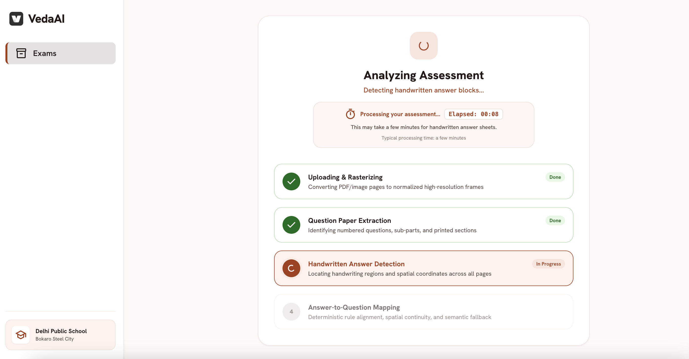
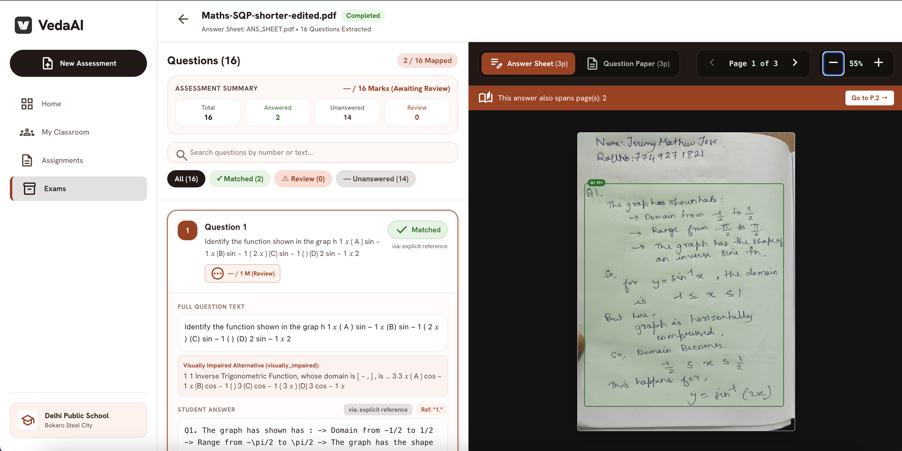
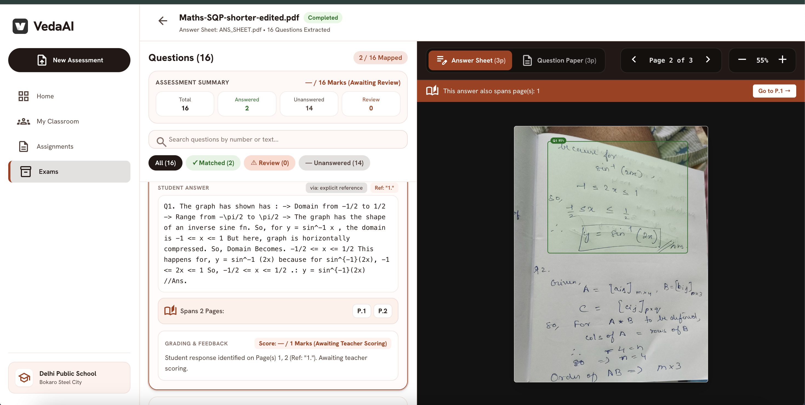
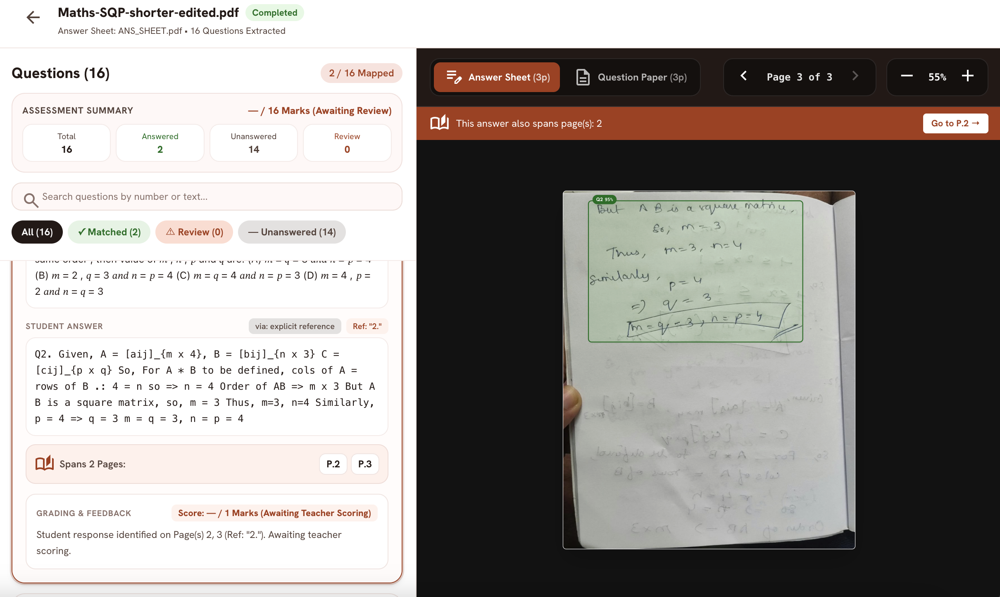
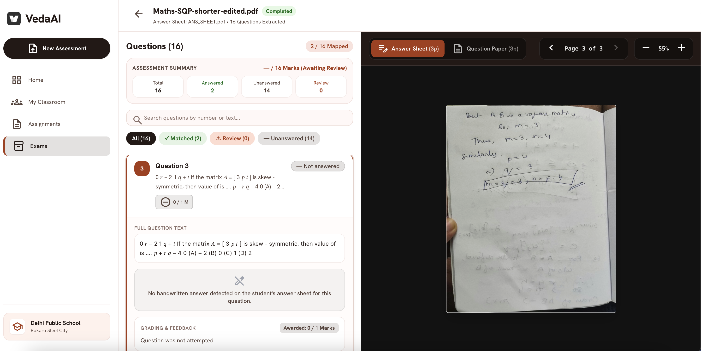
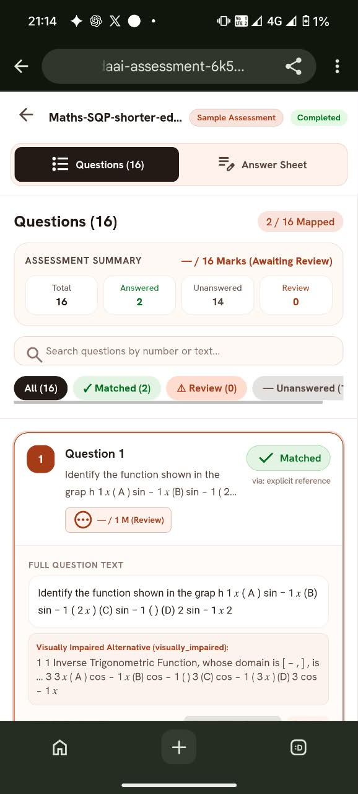
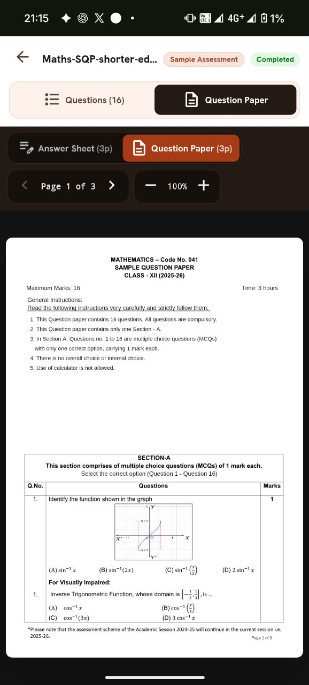
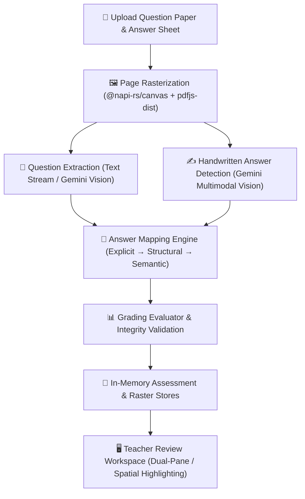
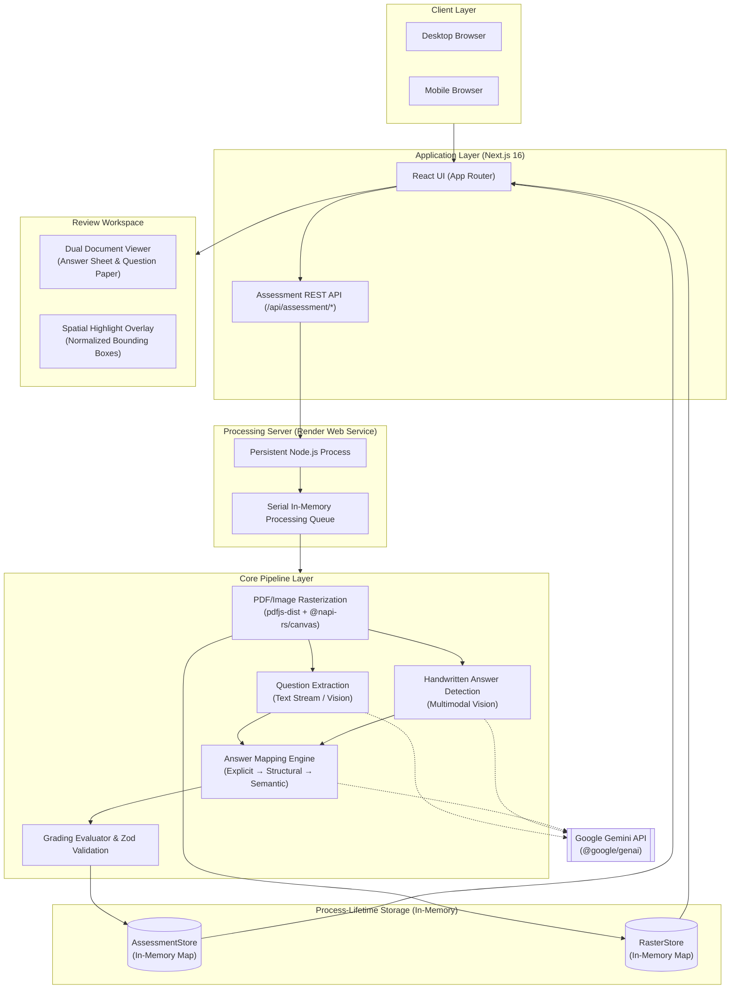

# VedaAI — AI Assessment Extraction & Answer Mapping

> An AI-powered academic assessment review application that extracts questions and handwritten student answers, aligns them using deterministic rules and semantic AI fallback, and provides spatial bounding-box grounding on the original answer sheet.

[](https://nextjs.org/)
[](https://react.dev/)
[](https://www.typescriptlang.org/)
[](https://tailwindcss.com/)
[](file:///tests)
[](https://vedaai-assessment-6k51.onrender.com/)

---

## 🚀 Live Demo

- **Live Deployed Application:** [https://vedaai-assessment-6k51.onrender.com/exams](https://vedaai-assessment-6k51.onrender.com/exams)
- **GitHub Repository:** [https://github.com/Chehrehmi/vedaai-assessment-extraction](https://github.com/Chehrehmi/vedaai-assessment-extraction)

### Frictionless One-Click Demo
Reviewers can evaluate the complete product immediately without preparing PDF files or configuring an API key:
1. Open the [Live Demo URL](https://vedaai-assessment-6k51.onrender.com/exams).
2. Click the **"Try Demo Assessment"** button.
3. The review workspace loads instantly with pre-validated CBSE Class XII Mathematics examination data.

---

## 🎥 Demo Video

> **Demo video:** [link]

---

## 🖼️ Product Walkthrough

### 1. Processing Pipeline
The multi-stage asynchronous processing stepper tracks document rasterization, question extraction, handwritten answer detection, and mapping, complete with a live elapsed-time counter and realistic guidance.



### 2. Assessment Review Workspace
The desktop review workspace features a 5/12 question navigation sidebar with the Assessment Summary banner, search bar, and status filter chips, alongside a 7/12 interactive document viewer.



### 3. Spatial Answer Grounding
Selecting a mapped question immediately highlights the student's handwritten response on the scanned answer sheet canvas, with direct navigation affordances for multi-page answers.



### 4. Mapping Provenance and Grading Review
Every mapped question displays its explicit decision provenance (`via: explicit reference`) and conservative scoring status, distinguishing spatial alignment from final teacher evaluation.



### 5. Unanswered Question Handling
Unattempted questions are explicitly identified as `— Unanswered` with `0 / 1 M` marks and `"Question was not attempted."` feedback, preventing hallucinated student work.



### 6. Mobile Review Experience
The responsive mobile workspace provides a segmented control (`Questions` / `Answer Sheet`) for fluid question inspection and document review on smaller viewports.



### 7. Question Paper Viewer
Educators can toggle seamlessly to the original printed Question Paper view to cross-reference question instructions, sub-parts, and mathematical equations.



---

## ✨ What VedaAI Does

Evaluating handwritten exam submissions is a fragmented, manual process. Teachers must constantly flip back and forth between printed question papers and multi-page handwritten student answer sheets—reconciling out-of-order answers, unlabelled sub-parts, and skipped questions.

**VedaAI eliminates manual answer lookup by providing end-to-end extraction and spatial grounding:**

- **Upload:** The teacher uploads a printed Question Paper and a handwritten Student Answer Sheet (PDF, PNG, or JPEG).
- **Extraction & Alignment:** VedaAI rasterizes pages at high DPI, extracts printed questions sequentially, detects handwritten answer blocks, and matches them using deterministic rules and semantic AI fallback.
- **Visual Grounding:** Clicking any question in the workspace immediately navigates to and highlights the exact handwritten answer region on the student's original answer sheet.

---

## 🎯 Key Capabilities

| Capability | Implementation Details |
|---|---|
| **Multi-Format Ingestion** | Accepts PDF, PNG, and JPEG documents up to 10MB per document. |
| **High-Fidelity Rasterization** | Renders crisp canvas frames with embedded standard font preservation (`@napi-rs/canvas` + `pdfjs-dist`). |
| **Sequential Question Extraction** | Extracts printed questions in exact visual order, preserving original numbering (`1`, `2`, `11(a)`, `11(b)`) and sub-parts. |
| **Handwritten Answer Detection** | Detects handwriting blocks and extracts normalized 2D bounding boxes (`[ymin, xmin, ymax, xmax]` in `[0..1]` fractional space). |
| **Out-of-Order Alignment** | Accurately maps student responses regardless of the sequence in which questions were attempted. |
| **Three-Tier Mapping Engine** | Evaluates answers via **Explicit Reference** (0.95), **Structural Sequence** (0.80), and **Semantic AI Fallback** (≥0.85). |
| **Status Classification** | Assigns unambiguous statuses: `Matched` (high confidence), `Needs Review` (heuristic/semantic), and `Unanswered`. |
| **Unanswered Detection** | Identifies unattempted questions with zero false-positive mappings or hallucinated text. |
| **Unmatched Answer Isolation** | Retains unassigned student handwriting in an accessible "Unmatched Answers" drawer. |
| **Multi-Page Answer Spans** | Links answers crossing page boundaries (e.g. Page 1 to Page 2) with instant page-jump buttons (`P.1`, `P.2`). |
| **Spatial Highlighting** | Renders interactive bounding boxes over student handwriting that persist across zooming and panning. |
| **Dual Document Viewer** | Enables instant toggling between Answer Sheet and Question Paper with zoom controls (`-`, `%`, `+`). |
| **Processing Progress & Timer** | Real-time 4-step stepper with live elapsed timer (`Elapsed: mm:ss`) and non-blocking error recovery. |
| **Mapping Provenance Badges** | Surfaces the exact decision method (`via: explicit reference`, `via: structural sequence`, `via: semantic similarity`). |
| **Assessment Grading Summary** | Compact summary card displaying question tallies, maximum marks (`16 M`), awarded marks, and pedagogical feedback. |
| **Mobile-Responsive Workspace** | Optimized layout with segmented tab navigation (`Questions` / `Answer Sheet`) and return-to-list controls. |

---

## 🧭 Product Workflow



1. **Upload & Validation:** Validates file signatures, MIME types, size boundaries, and non-empty streams.
2. **Rasterization:** Renders pages into normalized high-resolution canvas frames, resolving standard PDF fonts.
3. **Question Extraction:** Extracts question labels, text bodies, sub-parts, and optional visually-impaired alternatives.
4. **Answer Detection:** Detects student handwriting blocks, student-written question markers (e.g. `"Ans 1"`), and bounding coordinates.
5. **Answer Mapping:** Pairs questions to answers using deterministic rules first, falling back to semantic candidate evaluation.
6. **Grading Evaluation:** Tallies attempted questions, calculates maximum marks, and attaches structured pedagogical feedback.
7. **Interactive Review:** Renders the dual-pane workspace with real-time bounding-box overlays over student work.

---

## 🧠 Answer Mapping Strategy

The mapping engine prioritizes deterministic precision over probabilistic guessing, applying a conservative three-tier decision hierarchy:

```text
Student Answer Block
  │
  ├── 1. Explicit Reference (e.g., "Ans 1", "Q.2", "11(a)")
  │     └── Result: Matched (Confidence: 0.95) -> via: explicit reference
  │
  ├── 2. Structural Sequence (Single unlabelled answer aligned 1:1 with single question)
  │     └── Result: Matched (Confidence: 0.80) -> via: structural sequence
  │
  └── 3. Semantic AI Fallback (Vision candidate evaluation for complex / unlabelled answers)
        ├── Confidence >= 0.85 ──> Matched -> via: semantic similarity
        └── Confidence <  0.85 ──> Needs Review -> via: semantic similarity
```

### Provenance Labels in the UI
Every mapped card explicitly displays its matching origin:
- **`Matched`** `via: explicit reference` (detected student label)
- **`Matched`** `via: structural sequence` (1:1 positional match)
- **`Needs Review`** `via: semantic similarity` (heuristic or low-confidence candidate)
- **`— Unanswered`** (no answer detected; mapping method omitted)

---

## 📍 Spatial Grounding

Rather than simply reporting that an answer was found, VedaAI preserves the exact spatial geometry of the student's handwriting:

- **Resolution-Independent Coordinates:** Bounding boxes are normalized to fractional coordinates `[ymin, xmin, ymax, xmax]` in `[0..1]` space. Highlights remain pixel-accurate across desktop monitors, tablets, mobile screens, and arbitrary canvas zoom levels (50% to 200%).
- **Multi-Page Spans:** When an answer extends across multiple pages (such as Q1 continuing from Page 1 to Page 2), the system tracks all regional segments and provides instant page-jump affordances (`P.1`, `P.2`).
- **Canvas Rendering:** Highlights are rendered dynamically using SVG/Canvas overlay layers without modifying or re-encoding the underlying document image.

---

## 📝 Grading & Review

VedaAI maintains a strict separation between **answer mapping** (identifying where an answer is located) and **grading correctness** (evaluating whether the derivation is mathematically sound):

- **Truthful & Conservative:** The system does not claim autonomous correctness grading or fabricate arbitrary scores when an answer key is absent.
- **Unanswered Questions:** Confirmed unattempted questions are awarded **`0 / 1 Marks`** with feedback: `"Question was not attempted."`
- **Answered Questions:** Questions with detected student responses are flagged as **`— / 1 Marks (Awaiting Teacher Scoring)`** under `status: needs_review`, providing the exact page location (e.g., `"Student response identified on Page(s) 1, 2 (Ref: "1"). Awaiting teacher scoring."`).
- **Assessment Summary:** Top-level metrics aggregate Total Questions (16), Answered (2), Unanswered (14), Needs Review (2), and Marks Tally (`— / 16 Marks`).

---

## 🏗️ Architecture & Engineering Decisions



### Key Engineering Decisions
- **Persistent Node Service:** Long-running PDF rasterization and async pipeline orchestration execute within a persistent Node.js web service on Render, avoiding serverless lambda execution timeouts and state isolation issues.
- **Serial Execution Queue:** Upload processing jobs are serialized in memory to prevent concurrent high-DPI rasterization from exceeding the 512 MB memory threshold on Render Free instances.
- **In-Memory Store:** Fast, zero-dependency `Map` singletons (`assessmentStore`, `rasterStore`) provide instant data access without database overhead.

---

## 🔐 Reliability & Deployment

- **Runtime Zod Validation:** All API inputs, AI responses, and domain entities are strictly validated via Zod schemas.
- **Memory Management:** High-resolution page canvas buffers are cleaned up after serving to maintain a minimal memory footprint.
- **Sanitized Error Handling:** Processing failures transition gracefully to `status: failed` with sanitized error messages and retry options.
- **Deterministic Precedence:** Deterministic mappings are locked and cannot be overridden by subsequent semantic fallback passes.
- **Server-Side API Security:** Google Gemini API keys are restricted entirely to server-side execution and are never exposed to browser bundles.

---

## 🚀 Demo Assessment

The application includes a deterministic demo assessment accessible via the **"Try Demo Assessment"** button:

- **Question Paper Source:** `Maths-SQP-shorter-edited.pdf` (16 questions, Section A)
- **Answer Sheet Source:** `ANS_SHEET.pdf` (Handwritten answers for Q1 & Q2 across 3 pages)
- **Structure:**
  - **16 Total Questions** extracted in exact printed sequence.
  - **Q1 and Q2** mapped to multi-page handwritten answers with spatial bounding boxes.
  - **Q1** spans multiple pages (Page 1 and Page 2).
  - **Q3–Q16** classified as unattempted (`— Unanswered`, `0 / 1 Marks`).
- **Characteristics:** Completely deterministic, instant (<20ms response time), operates without live Gemini API calls, and is clearly designated as **Sample / Demo Data**.

---

## 🛠️ Local Development

### Prerequisites
- Node.js 20+
- npm 10+

### Installation & Setup

```bash
# Clone the repository
git clone https://github.com/Chehrehmi/vedaai-assessment-extraction.git
cd vedaai-assessment-extraction

# Install dependencies
npm install

# Configure environment variables
cp .env.example .env # or create .env
```

### Environment Variables (`.env`)

```env
# Google Gemini API Key (Server-side secret — do NOT prefix with NEXT_PUBLIC_)
GEMINI_API_KEY=your_gemini_api_key_here

# Optional: Supported fallback key variable
# LLM_API_KEY=your_gemini_api_key_here

# Optional: Gemini model override
# GEMINI_MODEL_NAME=gemini-2.5-flash
```

### Running Commands

```bash
# Start local development server (http://localhost:3000)
npm run dev

# Run full automated test suite
npm test

# Run TypeScript typecheck
npm run typecheck

# Run production build
npm run build

# Start production server
npm start
```

---

## 🧪 Testing

```text
✔ Phase 4: Eight Canonical QA Journeys Audit
✔ Phase 3C-C: End-to-End Processing Pipeline Orchestration
✔ Phase 3C-B: Semantic AI Fallback Layer
✔ Question Extraction & Sub-Part Parsing
✔ Document Rasterization & Standard Font Preservation
✔ Spatial Bounding-Box Normalization & Conversion
✔ Demo Assessment Feature Suite & Provenance
✔ Grading & Evaluation Layer Suite
✔ UX Polish: Processing Time & Mapping Method Labels
ℹ tests 209 | suites 14 | pass 209 | fail 0
```

- **Automated Tests:** **209 / 209 passing** across 14 test suites.
- **TypeScript Typecheck:** **0 errors** (`tsc --noEmit`).
- **Production Build:** Clean Next.js 16 build with Turbopack.
- **Code Quality Check:** `git diff --check` passes cleanly.

---

## 📌 Assignment Alignment

| Requirement | Status | Implementation Reference |
|---|:---:|---|
| **Upload QP & Answer Sheet (PDF/Image)** | ✅ | `app/exams/page.tsx`, `app/api/assessment/route.ts` |
| **Real-Time Processing Progress** | ✅ | `components/assessment/ProcessingStepper.tsx` (with live elapsed timer) |
| **Extract All Questions in Printed Order** | ✅ | `lib/extraction/question-extractor.ts`, `lib/domain/index.ts` |
| **Separate Sub-Questions & Numbering** | ✅ | Sub-part hierarchy (`11(a)`, `11(b)`) preserved in `Question` schema |
| **Detect Handwritten Answer Regions** | ✅ | `lib/ai/gemini-provider.ts`, normalized to fractional `[0..1]` bounds |
| **Handle Out-of-Order Answers** | ✅ | Explicit label normalization & structural intervals in `deterministic-mapper.ts` |
| **Identify Unanswered Questions** | ✅ | Classified as `status: unanswered` with `0` marks and unattempted feedback |
| **Preserve Unmatched Answers** | ✅ | Surfaced in accessible `UnmatchedAnswersPanel.tsx` |
| **Exact Answer-Region Highlighting** | ✅ | Dynamic SVG/Canvas overlay in `HighlightOverlay.tsx` |
| **Multi-Page Answer Spans** | ✅ | Multi-page bounding tracking and navigation buttons (`P.1`, `P.2`) |
| **Live Web Deployment** | ✅ | Live Render persistent web service deployment |
| **Optional Grading & Marks Layer** | ✅ | Assessment summary banner & question marks in `lib/grading/evaluator.ts` |
| **Frictionless Demo Workflow** | ✅ | One-click "Try Demo Assessment" in `lib/demo/demo-assessment.ts` |

---

## ⚠️ Known Limitations

- **Handwriting Transcription Variance:** Handwriting transcription fidelity depends on the underlying vision model and student handwriting clarity.
- **Bounding Box Granularity:** Bounding boxes provide answer-region spatial grounding rather than character-level OCR segmentation.
- **In-Memory Store Lifecycle:** Assessment records and raster caches reside in process memory and reset when the server restarts or redeploys (intended for single persistent Node.js instances).
- **Single-Assessment Scope:** Optimized for single-assessment review sessions per submission.
- **Processing Time:** Live processing time varies with document size, rasterization workload, and Gemini API latency. Multi-page handwritten assessments may take a few minutes on the deployed service.

---

## 📬 Submission Details

- **Live Deployed Application:** [https://vedaai-assessment-6k51.onrender.com/exams](https://vedaai-assessment-6k51.onrender.com/exams)
- **GitHub Repository:** [https://github.com/Chehrehmi/vedaai-assessment-extraction](https://github.com/Chehrehmi/vedaai-assessment-extraction)
- **AI Vision Provider:** Google Gemini (`@google/genai`)
- **Technology Stack:** Next.js 16 (Turbopack), React 19, TypeScript 5, TailwindCSS, `@napi-rs/canvas`, `pdfjs-dist`, Zod
